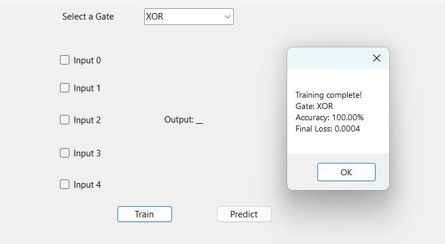

# 5-Input Logic Gate Trainer (C# WinForms + Neural Network)

A C# WinForms application that trains a basic neural network using **backpropagation** to simulate **5-input logic gates** — AND, OR, and XOR. Built entirely from scratch to demonstrate core machine learning concepts in a fun, interactive way.



---

## Features

- ✅ Train neural network on 5-input **AND**, **OR**, or **XOR** logic
- ✅ Predict output by toggling checkboxes for 5 binary inputs
- ✅ Tracks **accuracy** and **final loss** after training
- ✅ Prevents prediction without training first
- ✅ Modular, extensible neural network (easy to scale)

---

## 📂 Project Structure

```
NeuralNetworkLogicGates/ 
    ├── NeuralNetworkLogicGates.sln 
    ├── .gitignore 
    ├── README.md 
    └── NeuralNetworkLogicGates/ 
        ├── Form1.cs # UI logic and training flow 
        ├── Form1.Designer.cs # Auto-generated WinForms layout 
        ├── Form1.resx # Resource file 
        ├── NeuralNetwork.cs # Neural network: forward + backprop 
        ├── Program.cs # App entry point 
        └── NeuralNetworkLogicGates.csproj
```

---

## Requirements

- Visual Studio 2019 or newer
- .NET Framework 4.7.2 or higher

---

## How to Run

1. Clone this repository:
   ```bash
   git clone https://github.com/McKlay/5-InputLogicGateTrainer.git
2. Open the .sln file in Visual Studio.
3. Press F5 to build and run.
4. Select a gate (AND, OR, XOR), then click Train.
5. Use the checkboxes to set inputs and click Predict.

## Learning Objectives
- Understand feedforward and backpropagation from scratch
- Visualize binary logic classification
- See how neural networks generalize simple functions
- Get hands-on with C# + WinForms for ML UI prototyping

## 👨‍💻 Author
Clay Mark Sarte
GitHub: @McKlay